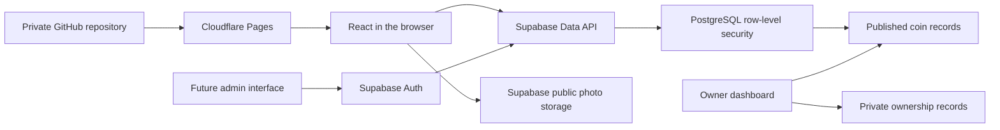

# Architecture and learning roadmap

## Why this stack

React provides reusable UI components. TypeScript supplies explicit types familiar to a C# developer. Vite produces static files, making deployment independent of a persistent server. Supabase supplies the SQL database, generated API, storage and future authentication.

A browser calling a database-backed API is safe when its database authorization is correct. The publishable key identifies the application; it does not authorize writes. PostgreSQL privileges and row-level policies control records. Custom ASP.NET Core code can be added later for specialized imports or integrations.

Search is a parameterized, security-invoker database function: it cannot bypass the caller's policies. Text search uses literal substrings, not user-provided SQL or wildcard patterns. Results include public record data, images and references only. Pagination, sorting and filtering happen before responses reach React.

Financial details are in a separate table with no anonymous access. Published descriptions and public extra attributes must contain only public information. Storage has independent access rules: a public photo URL is intentionally public even if its coin row becomes a draft.

## Free services, checked 3 October 2026

| Service          | Relevant limits                                                                                                                                | Decision                                                                  |
| ---------------- | ---------------------------------------------------------------------------------------------------------------------------------------------- | ------------------------------------------------------------------------- |
| Cloudflare Pages | 500 builds/month; 20,000 files; 25 MiB per asset; static requests free/unlimited; functions have Workers quotas                                | Frontend host                                                             |
| Supabase         | 500 MB database; 1 GB storage; 5 GB uncached + 5 GB cached egress/month; 50,000 MAU; two active free projects; low-activity projects can pause | Database, photos, future auth                                             |
| GitHub Pages     | Public repository required on GitHub Free; 1 GB site; soft 100 GB/month bandwidth; no backend                                                  | Feasible with external Supabase, less convenient for routing/future admin |
| Netlify          | 300 credits/month covering metered traffic, compute and production deploys; Free has a hard limit                                              | Alternative frontend host                                                 |
| Vercel Hobby     | Personal/noncommercial use; feature-specific quotas                                                                                            | Alternative, no need for its server-rendering features initially          |
| Firebase         | Spark Firestore: 1 GiB, 50,000 reads/day, 20,000 writes/day; Hosting: 10 GB, 360 MB/day; photo storage needs Blaze billing                     | Not chosen for a strict free-only photo setup                             |
| GitHub Free      | Private source repositories supported                                                                                                          | Source control                                                            |

Official references:

- [Cloudflare limits](https://developers.cloudflare.com/pages/platform/limits/) and [static request pricing](https://developers.cloudflare.com/pages/functions/pricing/)
- [Supabase quotas](https://supabase.com/docs/guides/platform/billing-on-supabase), [egress](https://supabase.com/docs/guides/platform/manage-your-usage/egress), [pausing](https://supabase.com/docs/guides/platform/free-project-pausing)
- [GitHub Pages limits](https://docs.github.com/en/pages/getting-started-with-github-pages/github-pages-limits)
- [Netlify Free](https://docs.netlify.com/manage/accounts-and-billing/billing/billing-for-credit-based-plans/credit-based-pricing-plans/)
- [Vercel Hobby](https://vercel.com/docs/plans/hobby)
- [Firebase pricing](https://firebase.google.com/pricing) and [storage requirements](https://firebase.google.com/docs/storage/faqs-storage-changes-announced-sept-2024)
- [GitHub plans](https://docs.github.com/en/get-started/learning-about-github/githubs-plans)

Recheck quotas before launching. Free service availability is not an uptime guarantee, and a domain purchase is outside the zero-cost starting budget.

## Learning milestones

1. Requirements: collect verified specimen data and both sides of your photos.
2. Technology: learn React components, TypeScript interfaces and SQL relationships.
3. Setup: reproduce installation with Node 24 and npm ci.
4. Database: apply the migration and inspect foreign keys, constraints and policies.
5. Design: understand spacing, typography, semantic HTML and responsive breakpoints.
6. Gallery: trace a coin from data to card, detail route and native image dialog.
7. Integration: follow an asynchronous query and its loading/error states.
8. Images: compare original file sizes with prepared exports and storage usage.
9. Search: inspect URL state, debouncing and server-side pagination.
10. Admin: use the dashboard now; implement single-owner Auth forms next.
11. Tests: run component, database-policy and cross-browser checks.
12. Deployment: connect GitHub to Cloudflare with public build settings.
13. Maintenance: export backups, track quotas, verify sources and plan enhancements.

The first release is client-rendered. Search engines and social crawlers may not receive full coin-specific metadata. Server rendering, advanced SEO, multilingual content, bulk import and continuous realtime updates are future improvements.
